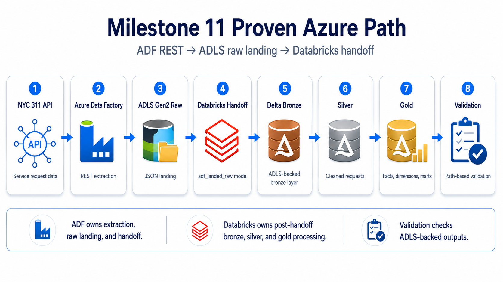

# NYC 311 Service Requests Lakehouse

Azure-first medallion lakehouse project for NYC 311 operational analytics. The project demonstrates API ingestion, Azure Data Factory orchestration, ADLS Gen2 raw landing, Databricks/PySpark processing, Delta Lake bronze/silver/gold layers, data quality checks, dimensional modeling, and Power BI-ready reporting marts.


## Tech stack

- Cloud orchestration: Azure Data Factory
- Storage: ADLS Gen2
- Processing: Azure Databricks, PySpark
- Lakehouse: Delta Lake bronze/silver/gold
- Modeling: SQL, dimensional modeling, reporting marts
- Quality: Python validation helpers, SQL validation, pytest
- Reporting: Power BI metric definitions and dashboard mockup

## One-minute review path

1. Review the [architecture diagram](docs/architecture/architecture-diagram.md).
2. Review the [Current Proven Azure Path](docs/architecture/data-flow.md).
3. Check [Milestone 11 proof screenshots](docs/screenshots/milestone-11/).
4. Open the [pipeline runbook](docs/runbooks/pipeline-runbook.md).
5. Review [gold marts](sql/marts/) and [validation SQL](sql/validation/).

## Architecture Diagram


Larger view and supporting notes: [docs/architecture/architecture-diagram.md](docs/architecture/architecture-diagram.md).

## Current Proven Azure Path



ADF owns extraction, raw JSON landing, and handoff parameters. Databricks owns post-handoff bronze, silver, and gold processing. Validation checks ADLS-backed outputs. In `adf_landed_raw` mode, bronze does not advance the source watermark.

Supporting docs: [pipeline runbook](docs/runbooks/pipeline-runbook.md), [architecture data flow](docs/architecture/data-flow.md), and [storage structure notes](infra/azure/storage-structure.md).

## What is proven

- Milestone 9 proved Azure Databricks + ADLS notebook execution for setup, bronze, silver, gold, and validation.
- Milestone 10 proved a real Databricks Jobs & Pipelines workflow using the same notebook chain.
- Milestone 11 proved real ADF REST -> ADLS raw landing plus ADF -> Databricks notebook handoff.
- The current proven path lands raw JSON in ADLS, processes bronze/silver/gold in Databricks, and validates ADLS-backed Delta outputs.
- Repo-side ADF and Databricks JSON files document the deployed shape and parameters, but they are starter deployment documentation, not full production IaC.

## Business Problem

NYC 311 service requests show how city issues are reported, routed, and resolved across agencies and locations. A lakehouse model helps move from raw API extraction to reusable analytics outputs for request volume, service performance, and backlog analysis.

Questions supported:

- How many requests arrive each day?
- Which agencies and complaint types drive demand?
- How long does resolution take?
- Where is backlog building up?

## Implemented scope

### Local pipeline logic

- API extraction helpers, pagination, watermark support, and bronze metadata handling in [src/ingestion](src/ingestion/).
- Silver cleaning, reference standardization, gold dimensions/facts, and marts in [src/transformation](src/transformation/).
- Reusable null, duplicate, schema, and row-count checks in [src/quality](src/quality/).

### Databricks and Delta Lake

- Databricks runtime helpers for widgets, ABFSS paths, catalog validation, schema setup, and ADLS access.
- Notebook exports for setup, bronze, silver, gold, and validation in [databricks/notebooks](databricks/notebooks/).
- ADLS-backed Delta bronze, silver, and gold outputs proven through Azure runs.

### SQL and analytics outputs

- SQL DDL, mart, and validation templates in [sql/ddl](sql/ddl/), [sql/marts](sql/marts/), and [sql/validation](sql/validation/).
- Gold outputs include `fact_service_requests`, `mart_request_volume_daily`, `mart_service_performance`, and `mart_backlog_snapshot`.
- Power BI metric definitions and dashboard mockup notes in [powerbi](powerbi/).

### Documentation and proof

- Architecture notes, runbooks, and screenshots in [docs](docs/).
- Starter deployment documentation for ADF and Databricks assets in [infra](infra/).

## Current implementation status

| Area | Status | Notes |
| --- | --- | --- |
| Local Python modules | Implemented | Extraction, transformation, quality checks, and gold model helpers |
| Databricks notebooks | Cloud proven | Used across Milestone 9, 10, and 11 proof paths |
| ADLS-backed Delta outputs | Cloud proven | Bronze, silver, and gold outputs written to ADLS-backed Delta locations |
| ADF raw landing + handoff | Cloud proven | Milestone 11 proved REST -> ADLS raw landing and Databricks handoff |
| Validation | Implemented with proof | Validation exists through notebooks, SQL/path-based checks, and local tests |
| Power BI delivery | Scaffolded | Metric definitions and mockup are included; finished report is future work |
| IaC/deployment automation | Starter documentation | ADF/Databricks JSON files document shape and parameters, not full production IaC |

## Proof details

<details>
<summary>Milestone 9 — Databricks + ADLS notebook execution</summary>

- First real Azure Databricks + ADLS notebook execution for setup, bronze, silver, gold, and validation.
- Confirmed secret lookups, catalog access, ADLS read/write, and ADLS-backed Delta outputs.
- Screenshot evidence covers setup proof, bronze proof, silver proof, gold proof, and validation proof.
- Evidence: [docs/screenshots/milestone-9](docs/screenshots/milestone-9/).

</details>

<details>
<summary>Milestone 10 — Databricks Jobs & Pipelines workflow</summary>

- Added a real Databricks workflow in Jobs & Pipelines using the same notebook chain proven in Milestone 9.
- Confirmed task dependencies, parameterized runs, DAG visibility, and end-to-end workflow execution.
- Workflow evidence includes successful job run, DAG views, and job parameter screenshots.
- Evidence: [docs/screenshots/milestone-10](docs/screenshots/milestone-10/) and [infra/databricks/workflow-job.json](infra/databricks/workflow-job.json).

</details>

<details>
<summary>Milestone 11 — ADF REST to ADLS landing + Databricks handoff</summary>

- Added a real ADF REST -> ADLS raw landing and ADF -> Databricks notebook handoff using `ingestion_mode=adf_landed_raw`.
- The handoff contract passes `environment`, `catalog`, `run_date`, `batch_id`, `window_start`, `window_end`, `ingestion_mode`, and `raw_landing_path`.
- Final Milestone 11 proof was completed in `dbw-test-centralus-01` after the original workspace entered a stale credits-exhausted state following a subscription upgrade.
- Earlier Milestone 9 and 10 evidence from the original workspace remains valid.
- Milestone 11 closeout validation in the new workspace used manual or path-based checks against ADLS-backed Delta outputs because the legacy validation notebooks expected registered `spark_catalog` tables.
- Repo-side ADF linked services, datasets, triggers, and pipeline JSON document the Milestone 11 shape, but they remain starter deployment assets rather than full IaC.
- Evidence: [docs/screenshots/milestone-11](docs/screenshots/milestone-11/), [docs/runbooks/pipeline-runbook.md](docs/runbooks/pipeline-runbook.md), and [docs/architecture/data-flow.md](docs/architecture/data-flow.md).

</details>

## Repository structure

```text
.
|-- config/       # environment config, schema files, runtime settings
|-- databricks/   # notebook exports and Databricks-side SQL
|-- docs/         # architecture notes, runbooks, screenshots
|-- infra/        # Azure, ADF, and Databricks starter deployment docs
|-- powerbi/      # downstream metric definitions and mockup notes
|-- sql/          # DDL, marts, and validation SQL
|-- src/          # local ingestion, transformation, quality, runtime helpers
`-- tests/        # unit and integration tests for local Python modules
```

Useful entry points:

- [src/common/databricks_runtime.py](src/common/databricks_runtime.py)
- [databricks/notebooks](databricks/notebooks/)
- [docs/runbooks/pipeline-runbook.md](docs/runbooks/pipeline-runbook.md)
- [infra/adf/pipeline_nyc311_ingest.json](infra/adf/pipeline_nyc311_ingest.json)
- [infra/databricks/workflow-job.json](infra/databricks/workflow-job.json)

## Quick start

This repo targets Python 3.11+ and keeps local dependencies intentionally small.

```bash
python -m venv .venv
.venv\Scripts\activate
python -m pip install -r requirements.txt
python -m pytest
```

Optional shortcuts:

```bash
make install
make test
```

Notes:

- Local tests validate Python helper logic, not a live Spark cluster, Databricks workspace, or Azure environment.
- Databricks notebooks are checked in as `.py` exports.
- Keep secrets out of source control.
- For cloud operating path and manual verification, start with [docs/runbooks/pipeline-runbook.md](docs/runbooks/pipeline-runbook.md).

## Future work

- Production-grade deployment automation, monitoring, alerting, and cluster policies.
- Hardened IaC beyond starter ADF/Databricks JSON files.
- Automated backfill/replay orchestration beyond manual reruns.
- Finished Power BI report deliverable.
- Storage isolation refinements for raw, curated, and log containers.
