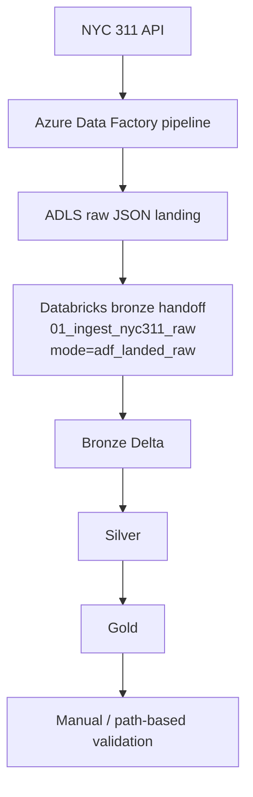

# NYC 311 Service Requests Lakehouse

Azure-first medallion lakehouse portfolio project for NYC 311 operational analytics.

**Tech stack:** Azure Data Factory, Azure Data Lake Storage Gen2, Azure Databricks, PySpark, Delta Lake, Python, SQL, Power BI


## Architecture Diagram


Larger view and supporting notes: [docs/architecture/architecture-diagram.md](docs/architecture/architecture-diagram.md).

## gi Quick Proof Summary

- `src/` implements the core local pipeline logic for extraction, bronze loading, silver cleaning, reusable quality checks, and gold modeling.
- Cloud proof exists across three milestones: Milestone 9 verified Databricks + ADLS notebook execution, Milestone 10 verified a real Databricks workflow, and Milestone 11 verified a real ADF REST -> ADLS raw landing plus Databricks notebook handoff.
- The current proven Milestone 11 path lands raw JSON in ADLS, processes bronze, silver, and gold in Databricks, and closes out with manual or path-based validation against ADLS-backed Delta outputs.
- Final Milestone 11 proof was completed in the new workspace `dbw-test-centralus-01`.
- Earlier Milestone 9 and 10 evidence from the original workspace remains valid.
- The original workspace later entered a stale credits-exhausted state after a subscription upgrade.
- Repo-side ADF and Databricks JSON files remain starter deployment documentation, not full production IaC.


## Current Proven Azure Path



### Why this path matters

- This is the current proven Milestone 11 cloud path.
- It proves a real ADF REST -> ADLS raw landing plus Databricks handoff.
- Earlier Milestone 9 / 10 proof started directly in Databricks and still remains valid.

### Ownership split

- ADF owns extraction, raw JSON landing, and handoff parameters.
- Databricks owns bronze, silver, and gold after the handoff.
- In `adf_landed_raw` mode, bronze does not advance the source watermark.

### Supporting docs

- [pipeline runbook](docs/runbooks/pipeline-runbook.md)
- [architecture data flow](docs/architecture/data-flow.md)
- [storage structure notes](infra/azure/storage-structure.md)

## Business Problem

NYC 311 service requests are useful operational data because they show how city issues are reported, routed, and resolved across agencies and locations. A lakehouse model makes it easier to move from raw API extraction to reusable analytics outputs that support volume, service performance, and backlog analysis.

Questions this project is designed to support:
- How many requests arrive each day?
- Which agencies and complaint types drive the most demand?
- How long does it take to resolve requests?
- Where is backlog building up, and which metrics are stable enough for downstream reporting?

## What Is Implemented

- Local ingestion helpers for paginated API extraction, watermark management, and bronze metadata or lineage handling in [src/ingestion](src/ingestion/).
- Local transformation logic for cleaned service requests, standardized reference tables, gold dimensions, facts, and marts in [src/transformation](src/transformation/).
- Reusable null, duplicate, schema, and row-count checks in [src/quality](src/quality/).
- Databricks runtime helpers for widgets, ABFSS path resolution, catalog validation, schema setup, and ADLS access in [src/common/databricks_runtime.py](src/common/databricks_runtime.py).
- Setup notebooks that validate widgets, secret lookups, catalog access, and ADLS smoke tests before the medallion flow runs.
- Databricks notebook exports for setup, bronze, silver, gold, and validation in [databricks/notebooks](databricks/notebooks/). These are the notebook exports used in the Milestone 9 cloud run, the Milestone 10 workflow, and the Milestone 11 handoff path.
- SQL templates for DDL, marts, and validation queries in [sql/ddl](sql/ddl/), [sql/marts](sql/marts/), and [sql/validation](sql/validation/).
- Silver outputs for cleaned service requests plus agency, complaint type, location, and status reference tables.
- Gold outputs represented in the repo include dimensions, `gold.fact_service_requests`, `gold.mart_request_volume_daily`, `gold.mart_service_performance`, and `gold.mart_backlog_snapshot`.
- Mart logic is mirrored between the local helper modules and the SQL templates so the transformations are inspectable from both Python and SQL assets.
- Architecture notes, runbooks, and screenshot evidence in [docs/architecture](docs/architecture/), [docs/runbooks](docs/runbooks/), and [docs/screenshots](docs/screenshots/).
- Downstream reporting definitions in [powerbi/metrics-definition.md](powerbi/metrics-definition.md) and [powerbi/nyc311_dashboard_mockup.md](powerbi/nyc311_dashboard_mockup.md).
- Starter deployment documentation for ADF and Databricks assets in [infra/adf](infra/adf/) and [infra/databricks](infra/databricks/).

## Current Implementation Status

| Area | Status | Notes |
| --- | --- | --- |
| Local Python modules | Implemented locally | `src/` contains extraction helpers, watermark logic, bronze metadata, silver transforms, quality checks, and gold models. |
| Databricks notebooks | Implemented and cloud proven | `databricks/notebooks/` was used in the Milestone 9 cloud notebook run, the Milestone 10 workflow, and the Milestone 11 handoff path. |
| ADLS-backed Delta outputs | Cloud proven | Bronze, silver, and gold outputs were written to ADLS-backed Delta locations in Azure runs. |
| Secret-driven storage access | Cloud proven | Setup notebooks validated secret lookups and ADLS access without exposing secret values. |
| Validation | Implemented with milestone-specific proof | Legacy validation notebooks were proven in Milestones 9 and 10. Milestone 11 closeout in the new workspace used manual or path-based validation against ADLS-backed Delta outputs because the legacy notebooks expected registered `spark_catalog` tables. |
| Databricks workflow | Cloud proven in the original workspace | A real Jobs & Pipelines workflow successfully ran end to end in Milestone 10, and that earlier evidence remains valid. |
| ADF raw landing and handoff | Cloud proven | Milestone 11 added a real REST -> ADLS raw landing and a Databricks notebook handoff. |
| Manual notebook execution | Implemented | Notebook-by-notebook execution remains available for debugging and targeted reruns. |
| Repo-side ADF / Databricks JSON | Starter deployment documentation | These files document the deployed shape and parameters, but they are not full production IaC or a complete export of the live environment. |
| Power BI delivery | Scaffolded | The repo includes metric definitions and a mockup, not a finished report package. |

## Short Milestone Proof Summary

### Milestone 9

- First real Azure Databricks + ADLS notebook execution for setup, bronze, silver, gold, and validation.
- Confirmed secret lookups, catalog access, ADLS read/write, and ADLS-backed Delta outputs.
- Screenshot evidence covers setup proof, bronze proof, silver proof, gold proof, and validation proof.
- Evidence: [docs/screenshots/milestone-9](docs/screenshots/milestone-9/).

### Milestone 10

- Added a real Databricks workflow in Jobs & Pipelines using the same notebook chain proven in Milestone 9.
- Confirmed task dependencies, parameterized runs, DAG visibility, and end-to-end workflow execution.
- Workflow evidence includes successful job run, DAG views, and job parameter screenshots.
- Evidence: [docs/screenshots/milestone-10](docs/screenshots/milestone-10/) and [infra/databricks/workflow-job.json](infra/databricks/workflow-job.json).

### Milestone 11

- Added a real ADF REST -> ADLS raw landing and ADF -> Databricks notebook handoff using `ingestion_mode=adf_landed_raw`.
- The handoff contract passes `environment`, `catalog`, `run_date`, `batch_id`, `window_start`, `window_end`, `ingestion_mode`, and `raw_landing_path`.
- Final Milestone 11 proof was completed in `dbw-test-centralus-01` after the original workspace entered a stale credits-exhausted state following a subscription upgrade.
- Earlier Milestone 9 and 10 evidence from the original workspace remains valid.
- Milestone 11 closeout validation in the new workspace used manual or path-based checks against ADLS-backed Delta outputs because the legacy validation notebooks expected registered `spark_catalog` tables.
- Repo-side ADF linked services, datasets, triggers, and pipeline JSON document the Milestone 11 shape, but they remain starter deployment assets rather than full IaC.
- Evidence: [docs/screenshots/milestone-11](docs/screenshots/milestone-11/), [docs/runbooks/pipeline-runbook.md](docs/runbooks/pipeline-runbook.md), and [docs/architecture/data-flow.md](docs/architecture/data-flow.md).

## Repository Structure

```text
.
|-- config/       # environment config, schema files, runtime settings
|-- databricks/   # notebook exports and Databricks-side SQL
|-- docs/         # architecture notes, runbooks, screenshots
|-- infra/        # Azure, ADF, and Databricks starter deployment docs
|-- powerbi/      # downstream metric definitions and mockup notes
|-- sql/          # DDL, marts, and validation SQL
|-- src/          # local ingestion, transformation, quality, runtime helpers
`-- tests/        # unit and integration tests for the local Python modules
```

Useful entry points:
- [src/common/databricks_runtime.py](src/common/databricks_runtime.py)
- [databricks/notebooks](databricks/notebooks/)
- [docs/runbooks/pipeline-runbook.md](docs/runbooks/pipeline-runbook.md)
- [infra/adf/pipeline_nyc311_ingest.json](infra/adf/pipeline_nyc311_ingest.json)
- [infra/databricks/workflow-job.json](infra/databricks/workflow-job.json)

## Quick Start

This repo targets Python 3.11+ and keeps local dependencies intentionally small.

```bash
python -m venv .venv
.venv\Scripts\activate
python -m pip install -r requirements.txt
python -m pytest
```

Optional shortcuts:

```bash
make install
make test
```

Notes:
- Local tests validate the Python helper surface, not a live Spark cluster, Databricks workspace, or Azure environment.
- Databricks notebooks are checked in as `.py` exports.
- Keep secret values out of source control; only secret names and non-sensitive runtime config belong in the repo.
- For the current cloud operating path and manual verification steps, start with [docs/runbooks/pipeline-runbook.md](docs/runbooks/pipeline-runbook.md).
- For a reviewer following the proof trail, the fastest path is the architecture note, then the Milestone 11 runbook, then the milestone screenshot folders.

## Future Work / Not Yet Implemented

- Production-grade CI/CD, monitoring, alerting, cluster policies, and broader operating controls.
- Hardened deployment packaging or IaC for ADF and Databricks beyond the starter JSON files in `infra/`.
- Automated backfill and replay orchestration beyond manual reruns; see [docs/runbooks/backfill-runbook.md](docs/runbooks/backfill-runbook.md).
- A finished Power BI report deliverable beyond the current metric definitions and mockup notes.
- Storage refinements such as dedicated raw, curated, and log containers with stricter environment isolation.
