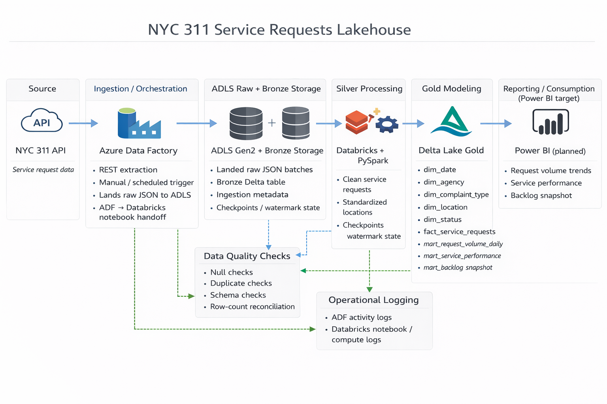

# NYC 311 Service Requests Lakehouse

## TL;DR

End-to-end NYC 311 lakehouse pipeline with:

- Bronze -> Silver -> Gold -> Validation implemented in Python + PySpark
- Real ADF REST -> ADLS raw landing plus a Databricks notebook handoff using `ingestion_mode=adf_landed_raw`
- Earlier Milestone 9 and 10 Databricks notebook and workflow evidence remains valid
- Final Milestone 11 proof captured in the new workspace `dbw-test-centralus-01`
- Manual/path-based validation against ADLS-backed Delta outputs for the Milestone 11 closeout

> Azure-first medallion lakehouse for NYC 311 operational analytics.

This repo shows how NYC 311 service request data can move from raw extraction to curated reporting outputs using bronze, silver, and gold layers. The core Python modules for ingestion, transformation, quality checks, and gold modeling are implemented locally. Milestone 9 established a working Azure Databricks + ADLS cloud notebook run, Milestone 10 added a real Databricks workflow in Jobs & Pipelines, and Milestone 11 added a real ADF REST-to-ADLS raw landing plus Databricks notebook handoff. The original Databricks workspace later entered a stale credits-exhausted state after a subscription upgrade, so the final Milestone 11 proof was completed in the new workspace `dbw-test-centralus-01`. Production-grade monitoring, CI/CD, and a finished Power BI delivery layer remain future work.

## Project Highlights

- implemented bronze, silver, gold, and reusable quality logic in `src/`
- exported Databricks notebooks that run the medallion flow in cloud against ADLS-backed Delta paths
- added a real ADF raw landing plus Databricks handoff contract and kept the earlier Databricks workflow evidence
- validated Databricks secret lookups, catalog access, ADLS read/write, and layer-by-layer outputs across Milestones 9 through 11
- kept the repo-side ADF and Databricks JSON files clearly marked as starter deployment assets rather than a production deployment

## Project Card Copy

- Title: NYC 311 Service Requests Lakehouse
- Subtitle: Azure-first medallion lakehouse for operational analytics
- Short description: NYC 311 lakehouse project with implemented bronze, silver, gold, and quality logic plus a real ADF raw landing, Databricks handoff, and earlier Databricks workflow proof.
- Stack tags: Azure Data Lake Storage Gen2, Azure Databricks, PySpark, Python, Delta Lake, SQL, Power BI, Azure Data Factory

## GitHub Metadata Suggestions

- About description: Azure-first medallion lakehouse for NYC 311 service request analytics with implemented bronze, silver, gold, and quality logic plus a real ADF raw landing, Databricks handoff, and earlier Databricks workflow proof.
- Recommended topics: `azure-data-factory`, `azure-data-lake-storage`, `databricks`, `delta-lake`, `lakehouse`, `medallion-architecture`, `data-engineering`, `dimensional-modeling`, `pyspark`, `power-bi`

## Project Overview

Current proven Milestone 11 path:

```text
NYC 311 API
  -> Azure Data Factory pipeline
  -> ADLS raw JSON landing
  -> Databricks notebook handoff
  -> ADLS Gen2 Delta bronze / silver / gold
  -> manual/path-based validation
```

Earlier proven Milestone 9 / 10 path:

```text
NYC 311 API
  -> Databricks workflow
  -> Databricks notebooks
  -> ADLS Gen2 Delta bronze / silver / gold
  -> validation notebooks
```

The goal of the repo is to show an end-to-end lakehouse design while being explicit about what is already running in cloud, what was proven in earlier milestones, and what still exists as future work or deployment scaffolding.

## Architecture Diagram



A larger version and supporting notes are available in [docs/architecture/architecture-diagram.md](docs/architecture/architecture-diagram.md).

## Business Problem

NYC 311 data is operationally valuable because it reflects how city services are requested, triaged, and resolved across agencies and neighborhoods. A lakehouse model makes it easier to answer questions such as:

- how many requests are arriving each day
- which agencies and complaint types are driving the most demand
- how long it takes to resolve requests
- where backlog is building up
- which operational metrics are stable enough to publish into a reporting layer

## Current Implementation Status

| Area | Status | Notes |
| --- | --- | --- |
| Local Python modules | Implemented | `src/` contains bronze ingestion helpers, silver cleaning, reusable quality checks, gold dimensions, fact, and marts |
| Databricks notebooks | Implemented and cloud verified | `databricks/notebooks/` runs the bronze, silver, gold, and validation flow in Azure Databricks and remains the notebook logic executed by the workflow |
| ADLS Gen2 pathing and Delta writes | Implemented and cloud verified | runtime config resolves ABFSS paths and the notebooks write Delta-backed outputs to ADLS |
| Secret-driven storage access | Implemented and cloud verified | Databricks setup notebooks validate a secret scope and configure ADLS access without exposing values |
| Validation notebooks | Implemented with Milestone-specific proof | the legacy validation notebooks remain in the repo and were proven in earlier Databricks runs; the final Milestone 11 closeout used manual/path-based validation against ADLS-backed Delta data because the legacy notebooks expected registered metastore tables in `spark_catalog` |
| Databricks workflow | Implemented and verified in the original workspace | a real Databricks workflow successfully ran end to end in Jobs & Pipelines for Milestone 10; that earlier evidence remains valid even though the final Milestone 11 proof moved to `dbw-test-centralus-01` after the original workspace entered a stale credits-exhausted state |
| ADF orchestration | Implemented for raw landing and notebook handoff | ADF now performs the real REST -> ADLS raw landing and triggers the Databricks bronze handoff; the repo JSON still serves as starter deployment documentation rather than a full export or IaC package |
| Power BI delivery | Scaffolded | the repo models Power BI as a downstream consumer but does not include a finished report package |

## What Is Implemented

- [src/ingestion/api_extract.py](src/ingestion/api_extract.py): paginated NYC 311 extraction helper
- [src/ingestion/watermark.py](src/ingestion/watermark.py): watermark state helpers for incremental extraction
- [src/ingestion/bronze_loader.py](src/ingestion/bronze_loader.py): bronze metadata, record hashes, and lineage path generation
- [src/transformation/silver_service_requests.py](src/transformation/silver_service_requests.py): request cleaning, timestamp handling, derivations, and deduplication
- [src/transformation/silver_reference_tables.py](src/transformation/silver_reference_tables.py): silver reference outputs for agencies, complaint types, locations, and statuses
- [src/quality/](src/quality/): reusable validation helpers for nulls, duplicates, schema checks, and row counts
- [src/transformation/gold_dimensions.py](src/transformation/gold_dimensions.py), [src/transformation/gold_facts.py](src/transformation/gold_facts.py), and [src/transformation/gold_marts.py](src/transformation/gold_marts.py): gold modeling helpers
- [src/common/databricks_runtime.py](src/common/databricks_runtime.py): widget handling, ABFSS path resolution, catalog validation, schema creation, and ADLS access setup
- [databricks/notebooks/](databricks/notebooks/): Databricks notebook exports used for the Milestone 9 cloud notebook run, the Milestone 10 workflow, and the Milestone 11 ADF handoff

## Milestone 9 - Foundation: real cloud execution in ADLS + Databricks

Milestone 9 established the first working cloud notebook path in Azure Databricks against ADLS. Milestone 10 builds on this same notebook chain by running it through a real Databricks workflow.

### What became real in this milestone

- the Databricks notebooks are no longer only design exports; they now run in Azure Databricks against cloud storage
- bronze, silver, gold, and validation outputs are written to ADLS-backed Delta locations
- the setup notebooks validate Databricks secret access, Unity Catalog access, and ADLS read/write before the medallion flow runs
- screenshot evidence for setup, bronze, silver, gold, and validation runs is captured under [docs/screenshots/milestone-9/](docs/screenshots/milestone-9/)

### Existing repo components upgraded

- [src/common/databricks_runtime.py](src/common/databricks_runtime.py) now resolves environment config, ABFSS paths, catalog selection, schema creation, and secret-driven ADLS access
- [config/dev.yaml](config/dev.yaml) contains the current dev storage account, container, catalog, and secret key names used by the cloud execution path
- [databricks/notebooks/00_setup/](databricks/notebooks/00_setup/) validates widgets, secret lookups, catalog access, and storage connectivity
- [databricks/notebooks/01_bronze/](databricks/notebooks/01_bronze/), [databricks/notebooks/02_silver/](databricks/notebooks/02_silver/), [databricks/notebooks/03_gold/](databricks/notebooks/03_gold/), and [databricks/notebooks/04_validation/](databricks/notebooks/04_validation/) execute the medallion and validation flow in cloud

### Notebook flow mapped to bronze, silver, gold, and validation

| Stage | Notebook flow | Main outputs |
| --- | --- | --- |
| Setup | `00_setup/01_secrets_and_widgets` -> `00_setup/00_mounts_and_paths` | widget defaults, secret validation, catalog validation, ADLS smoke test |
| Bronze | `01_bronze/01_ingest_nyc311_raw` -> `01_bronze/02_bronze_dedup_metadata` | `bronze.nyc311_service_requests_raw`, watermark state, bronze lineage metadata |
| Silver | `02_silver/01_clean_service_requests` -> `02_silver/02_standardize_locations` -> `02_silver/03_standardize_categories` -> `02_silver/04_apply_quality_rules` | `silver.service_requests_clean` plus silver reference tables |
| Gold | `03_gold/01_build_dim_date` -> `03_gold/02_build_dim_agency` -> `03_gold/03_build_dim_complaint_type` -> `03_gold/04_build_dim_location` -> `03_gold/05_build_dim_status` -> `03_gold/06_build_fact_service_requests` -> `03_gold/07_build_mart_request_volume_daily` -> `03_gold/08_build_mart_service_performance` -> `03_gold/09_build_mart_backlog_snapshot` | dimensions, fact table, and marts in `gold` |
| Validation | `04_validation/01_bronze_validation` -> `04_validation/02_silver_validation` -> `04_validation/03_gold_validation` | printed summaries plus fail-fast quality and reconciliation checks |

### Azure resources used at a high level

- Azure Data Lake Storage Gen2 for Delta table storage and watermark state
- an Azure Databricks workspace for notebook execution
- Unity Catalog for the active catalog and bronze, silver, and gold schemas
- a Databricks secret scope for ADLS credentials
- this was the Milestone 9 / 10 execution shape; Milestone 11 later adds ADF raw landing and Databricks handoff

### ADLS path structure at a high level

- `abfss://nyc311@<storage-account>.dfs.core.windows.net/bronze/` for the bronze table path and checkpoint state
- `abfss://nyc311@<storage-account>.dfs.core.windows.net/silver/` for the cleaned silver table and silver reference tables
- `abfss://nyc311@<storage-account>.dfs.core.windows.net/gold/` for dimensions, fact, and marts
- `abfss://nyc311@<storage-account>.dfs.core.windows.net/bronze/checkpoints/nyc311_service_requests/watermark_state/` for incremental watermark persistence
- `bronze/.../raw_batches/...` remains lineage metadata for the Databricks-managed API extract mode, while Milestone 11 adds a separate ADF raw landing path under `abfss://raw@<storage-account>.dfs.core.windows.net/nyc311/service_requests/raw/ingest_date=<run_date>/`

More detail is in [infra/azure/storage-structure.md](infra/azure/storage-structure.md).

### How Databricks accesses secrets at a high level

- [databricks/notebooks/00_setup/01_secrets_and_widgets.py](databricks/notebooks/00_setup/01_secrets_and_widgets.py) creates widgets for `secret_scope`, `sp_client_id_key`, `sp_client_secret_key`, and `sp_tenant_id_key`
- the current dev config expects Databricks secret scope `adls-sp` with key names `client-id`, `client-secret`, and `tenant-id`
- the setup notebook validates secret lookups with `dbutils.secrets.get` without printing any secret values
- [src/common/databricks_runtime.py](src/common/databricks_runtime.py) applies OAuth Spark settings for ADLS when manual storage auth is needed and can fall back to workspace-managed access patterns when direct Spark storage config is unavailable

### Notebook order used by the cloud run and workflow

1. `databricks/notebooks/00_setup/01_secrets_and_widgets.py`
2. `databricks/notebooks/00_setup/00_mounts_and_paths.py`
3. `databricks/notebooks/01_bronze/01_ingest_nyc311_raw.py`
4. `databricks/notebooks/01_bronze/02_bronze_dedup_metadata.py`
5. `databricks/notebooks/02_silver/01_clean_service_requests.py`
6. `databricks/notebooks/02_silver/02_standardize_locations.py`
7. `databricks/notebooks/02_silver/03_standardize_categories.py`
8. `databricks/notebooks/02_silver/04_apply_quality_rules.py`
9. `databricks/notebooks/03_gold/01_build_dim_date.py`
10. `databricks/notebooks/03_gold/02_build_dim_agency.py`
11. `databricks/notebooks/03_gold/03_build_dim_complaint_type.py`
12. `databricks/notebooks/03_gold/04_build_dim_location.py`
13. `databricks/notebooks/03_gold/05_build_dim_status.py`
14. `databricks/notebooks/03_gold/06_build_fact_service_requests.py`
15. `databricks/notebooks/03_gold/07_build_mart_request_volume_daily.py`
16. `databricks/notebooks/03_gold/08_build_mart_service_performance.py`
17. `databricks/notebooks/03_gold/09_build_mart_backlog_snapshot.py`
18. `databricks/notebooks/04_validation/01_bronze_validation.py`
19. `databricks/notebooks/04_validation/02_silver_validation.py`
20. `databricks/notebooks/04_validation/03_gold_validation.py`

### Screenshots and evidence to capture

- Databricks compute running and attached to the notebook session
- secret scope and widget validation success
- ADLS smoke-test success and storage browser proof for bronze, silver, gold, and checkpoint folders
- bronze ingest success, bronze table registration, and dedup success
- silver clean, location standardization, category standardization, and silver quality rules success
- gold dimensions, fact table, and mart notebook success
- bronze, silver, and gold validation notebooks passing

Existing Milestone 9 evidence is already stored under [docs/screenshots/milestone-9/](docs/screenshots/milestone-9/), including setup proof, bronze proof, silver proof, gold proof, and validation proof.

## Milestone 10 - Real Databricks workflow execution

### What became real in this milestone

- a real Databricks workflow now exists in Jobs & Pipelines and successfully ran the medallion flow end to end
- the workflow uses runtime parameters `environment` and `run_date`
- queueing is enabled and the workflow allows only one concurrent run at a time
- the workflow enforces task dependencies from setup through validation, so downstream tasks wait for upstream success
- task-level DAG visibility, run history, and failed-task inspection are now part of the working cloud path
- the workflow runs the same setup, bronze, silver, gold, and validation notebook chain proven in Milestone 9, now as a Databricks workflow rather than only as manual notebook sequencing
- screenshot proof for the successful run, workflow DAG, and job parameters is stored under [docs/screenshots/milestone-10/](docs/screenshots/milestone-10/)

### Workflow run evidence

- successful workflow run screenshot: [docs/screenshots/milestone-10/m10-successful-job-run.png](docs/screenshots/milestone-10/m10-successful-job-run.png)
- workflow DAG screenshots: [docs/screenshots/milestone-10/m10-workflow-dag-part1-setup-bronze-silver.png](docs/screenshots/milestone-10/m10-workflow-dag-part1-setup-bronze-silver.png) and [docs/screenshots/milestone-10/m10-workflow-dag-part2-gold-validation.png](docs/screenshots/milestone-10/m10-workflow-dag-part2-gold-validation.png)
- job parameters screenshot showing `environment` and `run_date`: [docs/screenshots/milestone-10/m10-job-parameters.png](docs/screenshots/milestone-10/m10-job-parameters.png)

### What is still future work or still scaffolded

- a hardened deployment story for ADF and Databricks assets beyond the repo-side starter JSON files
- production-grade cluster policies, CI/CD, monitoring, alerting, and infrastructure-as-code
- a hardened backfill and replay operating model beyond manual notebook reruns
- Power BI assets beyond architecture and downstream-consumer placeholders

## Milestone 11 - ADF raw landing and Databricks handoff

### What became real in this milestone

- ADF now performs the real NYC 311 REST extraction and lands raw JSON to ADLS
- the ADF pipeline then triggers the Databricks bronze handoff notebook with `ingestion_mode=adf_landed_raw`
- the raw landing path pattern is `abfss://raw@<storage-account>.dfs.core.windows.net/nyc311/service_requests/raw/ingest_date=<run_date>/nyc311_service_requests_<batch_id>.json`
- the handoff contract uses `environment`, `catalog`, `run_date`, `batch_id`, `window_start`, `window_end`, `ingestion_mode`, and `raw_landing_path`
- earlier Milestone 9 and 10 evidence from the original workspace remains valid
- the original workspace later entered a stale credits-exhausted state after a subscription upgrade, so the final Milestone 11 proof was completed in the new workspace `dbw-test-centralus-01`
- the final Milestone 11 validation in the new workspace was completed with manual/path-based verification against ADLS-backed Delta data because the legacy validation notebooks expected registered metastore tables in `spark_catalog`

### ADF and Databricks handoff notes

- linked service names in the repo-side starter assets are `ls_nyc311_http`, `ls_adls_nyc311`, and `ls_databricks_nyc311`
- ADF pipeline parameters are `environment`, `catalog`, `run_date`, `window_start`, `window_end`, `page_size`, and `batch_id`
- the Databricks notebook mapping keeps `ingestion_mode=adf_landed_raw` constant and derives `raw_landing_path` from the `run_date`
- ADF owns the source extraction window and raw landing, while Databricks owns downstream Delta outputs and lakehouse-side checkpoint or watermark handling after the handoff

### Milestone 11 evidence

- ADF pipeline and run screenshots: `docs/screenshots/milestone-11/m11_adf_pipeline_canvas.png` and `docs/screenshots/milestone-11/m11_adf_run_success.png`
- Databricks handoff and bronze receipt screenshots: `docs/screenshots/milestone-11/m11_adf_to_databricks_handoff.png`, `docs/screenshots/milestone-11/m11_databricks_run_success.png`, and `docs/screenshots/milestone-11/m11_bronze_received_batch.png`
- raw landing, watermark, gold, and validation screenshots: `docs/screenshots/milestone-11/m11_adls_raw_landing.png`, `docs/screenshots/milestone-11/m11_watermark_state.png`, `docs/screenshots/milestone-11/m11_gold_outputs.png`, and `docs/screenshots/milestone-11/m11_validation_passed.png`
- end-to-end architecture screenshot: `docs/screenshots/milestone-11/m11_end_to_end_architecture.png`

## Gold Outputs And Marts

Gold outputs represented in the repo include:

- dimensions: `gold.dim_date`, `gold.dim_agency`, `gold.dim_complaint_type`, `gold.dim_location`, `gold.dim_status`
- fact table: `gold.fact_service_requests`
- `gold.mart_request_volume_daily`: daily request counts
- `gold.mart_service_performance`: closure counts and average resolution time by agency and complaint type
- `gold.mart_backlog_snapshot`: open backlog counts by snapshot date, status, and agency

The mart definitions are implemented in local helper modules and mirrored in the SQL templates under [sql/marts/](sql/marts/).

## Current Repository Structure

```text
.
|-- config/       # environment config, storage paths, and runtime settings
|-- databricks/   # notebook exports and Databricks-side SQL assets
|-- docs/         # architecture notes, runbooks, data dictionaries, and screenshots
|-- infra/        # Azure, ADF, and Databricks deployment notes or starter templates
|-- powerbi/      # downstream placeholder area
|-- sql/          # DDL, marts, and validation SQL templates
|-- src/          # implemented local Python helpers
`-- tests/        # unit and integration tests for the Python modules
```

Useful entry points:

- [src/common/config_loader.py](src/common/config_loader.py)
- [src/common/databricks_runtime.py](src/common/databricks_runtime.py)
- [src/ingestion/api_extract.py](src/ingestion/api_extract.py)
- [src/transformation/silver_service_requests.py](src/transformation/silver_service_requests.py)
- [src/quality/null_checks.py](src/quality/null_checks.py)
- [src/transformation/gold_dimensions.py](src/transformation/gold_dimensions.py)
- [src/transformation/gold_facts.py](src/transformation/gold_facts.py)
- [src/transformation/gold_marts.py](src/transformation/gold_marts.py)
- [infra/adf/pipeline_nyc311_ingest.json](infra/adf/pipeline_nyc311_ingest.json)
- [infra/databricks/workflow-job.json](infra/databricks/workflow-job.json)

## Setup Notes

This repo targets Python 3.11 and keeps local dependencies intentionally small.

```bash
python -m venv .venv
.venv\Scripts\activate
python -m pip install -r requirements.txt
python -m pytest
```

Optional shortcuts:

```bash
make install
make test
```

Notes:

- the notebook files are `.py` exports of the Databricks notebooks used in the Milestone 9 cloud run, the Milestone 10 workflow, and the Milestone 11 handoff
- local tests validate the Python helper surface, not a live Spark or Azure workspace
- the repo currently uses `PyYAML` and `pytest` for local support and tests
- keep secret values out of source control; only secret names and non-sensitive runtime config belong in checked-in files
- treat `infra/adf/`, [infra/databricks/workflow-job.json](infra/databricks/workflow-job.json), and [infra/databricks/cluster-config.json](infra/databricks/cluster-config.json) as repo-side deployment starters rather than completed production assets
