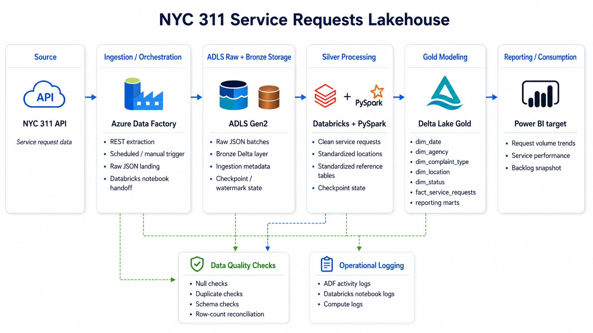

# NYC 311 Service Requests Lakehouse

> Azure-first medallion lakehouse for NYC 311 operational analytics.

This repo shows how NYC 311 service request data can move from raw extraction to curated reporting outputs using bronze, silver, and gold layers. The core Python modules for ingestion, transformation, quality checks, and gold modeling are implemented locally, and Milestone 9 adds a working manual cloud run in Azure Databricks writing Delta-backed bronze, silver, gold, and validation outputs to ADLS Gen2. ADF orchestration, deployed Databricks jobs, and Power BI delivery remain future work or scaffolding.

## Project Highlights

- implemented bronze, silver, gold, and reusable quality logic in `src/`
- exported Databricks notebooks that run the medallion flow in cloud against ADLS-backed Delta paths
- validated Databricks secret lookups, Unity Catalog access, ADLS read/write, and layer-by-layer outputs
- kept ADF, workflow JSON, and cluster JSON clearly marked as starter deployment assets rather than a production deployment

## Project Card Copy

- Title: NYC 311 Service Requests Lakehouse
- Subtitle: Azure-first medallion lakehouse for operational analytics
- Short description: NYC 311 lakehouse project with implemented bronze, silver, gold, and quality logic plus a working manual Azure Databricks + ADLS execution path for the medallion pipeline.
- Stack tags: Azure Data Lake Storage Gen2, Azure Databricks, PySpark, Python, Delta Lake, SQL, Power BI, Azure Data Factory

## GitHub Metadata Suggestions

- About description: Azure-first medallion lakehouse for NYC 311 service request analytics with implemented bronze, silver, gold, and quality logic plus a working manual Databricks-to-ADLS cloud run.
- Recommended topics: `azure-data-factory`, `azure-data-lake-storage`, `databricks`, `delta-lake`, `lakehouse`, `medallion-architecture`, `data-engineering`, `dimensional-modeling`, `pyspark`, `power-bi`

## Project Overview

Current proven Milestone 9 path:

```text
NYC 311 API
  -> Azure Databricks notebooks
  -> ADLS Gen2 Delta bronze / silver / gold
  -> validation notebooks
```

Planned future orchestration path:

```text
NYC 311 API
  -> Azure Data Factory
  -> Databricks workflow / job deployment
  -> Power BI
```

The goal of the repo is to show an end-to-end lakehouse design while being explicit about what is already running in cloud and what still exists as deployment scaffolding.

## Architecture Diagram



A larger version and supporting notes are available in [docs/architecture/architecture-diagram.md](docs/architecture/architecture-diagram.md).

## Business Problem

NYC 311 data is operationally valuable because it reflects how city services are requested, triaged, and resolved across agencies and neighborhoods. A lakehouse model makes it easier to answer questions such as:

- how many requests are arriving each day
- which agencies and complaint types are driving the most demand
- how long it takes to resolve requests
- where backlog is building up
- which operational metrics are stable enough to publish into a reporting layer

## Current Implementation Status

| Area | Status | Notes |
| --- | --- | --- |
| Local Python modules | Implemented | `src/` contains bronze ingestion helpers, silver cleaning, reusable quality checks, gold dimensions, fact, and marts |
| Databricks notebooks | Implemented and manually verified | `databricks/notebooks/` runs the bronze, silver, gold, and validation flow in Azure Databricks |
| ADLS Gen2 pathing and Delta writes | Implemented and manually verified | runtime config resolves ABFSS paths and the notebooks write Delta-backed outputs to ADLS |
| Secret-driven storage access | Implemented and manually verified | Databricks setup notebooks validate a secret scope and configure ADLS access without exposing values |
| Validation notebooks | Implemented and manually verified | bronze, silver, and gold validation notebooks fail fast on quality or reconciliation issues |
| Databricks workflow deployment | Draft only | `infra/databricks/workflow-job.json` documents the run order but is not a deployed job |
| ADF orchestration | Scaffolded | `infra/adf/` remains a design and handoff template, not the path used for the current Milestone 9 run |
| Power BI delivery | Scaffolded | the repo models Power BI as a downstream consumer but does not include a finished report package |

## What Is Implemented

- [src/ingestion/api_extract.py](src/ingestion/api_extract.py): paginated NYC 311 extraction helper
- [src/ingestion/watermark.py](src/ingestion/watermark.py): watermark state helpers for incremental extraction
- [src/ingestion/bronze_loader.py](src/ingestion/bronze_loader.py): bronze metadata, record hashes, and lineage path generation
- [src/transformation/silver_service_requests.py](src/transformation/silver_service_requests.py): request cleaning, timestamp handling, derivations, and deduplication
- [src/transformation/silver_reference_tables.py](src/transformation/silver_reference_tables.py): silver reference outputs for agencies, complaint types, locations, and statuses
- [src/quality/](src/quality/): reusable validation helpers for nulls, duplicates, schema checks, and row counts
- [src/transformation/gold_dimensions.py](src/transformation/gold_dimensions.py), [src/transformation/gold_facts.py](src/transformation/gold_facts.py), and [src/transformation/gold_marts.py](src/transformation/gold_marts.py): gold modeling helpers
- [src/common/databricks_runtime.py](src/common/databricks_runtime.py): widget handling, ABFSS path resolution, catalog validation, schema creation, and ADLS access setup
- [databricks/notebooks/](databricks/notebooks/): Databricks notebook exports used for the Milestone 9 manual cloud execution path

## Milestone 9 &#8212; Real cloud execution in ADLS + Databricks

### What became real in this milestone

- the Databricks notebooks are no longer only design exports; they now run in Azure Databricks against cloud storage
- bronze, silver, gold, and validation outputs are written to ADLS-backed Delta locations
- the setup notebooks validate Databricks secret access, Unity Catalog access, and ADLS read/write before the medallion flow runs
- screenshot evidence for setup, bronze, silver, gold, and validation runs is captured under [docs/screenshots/milestone-9/](docs/screenshots/milestone-9/)

### Existing repo components upgraded

- [src/common/databricks_runtime.py](src/common/databricks_runtime.py) now resolves environment config, ABFSS paths, catalog selection, schema creation, and secret-driven ADLS access
- [config/dev.yaml](config/dev.yaml) contains the current dev storage account, container, catalog, and secret key names used by the manual cloud run
- [databricks/notebooks/00_setup/](databricks/notebooks/00_setup/) validates widgets, secret lookups, catalog access, and storage connectivity
- [databricks/notebooks/01_bronze/](databricks/notebooks/01_bronze/), [databricks/notebooks/02_silver/](databricks/notebooks/02_silver/), [databricks/notebooks/03_gold/](databricks/notebooks/03_gold/), and [databricks/notebooks/04_validation/](databricks/notebooks/04_validation/) execute the medallion and validation flow in cloud

### Notebook flow mapped to bronze, silver, gold, and validation

| Stage | Notebook flow | Main outputs |
| --- | --- | --- |
| Setup | `00_setup/01_secrets_and_widgets` -> `00_setup/00_mounts_and_paths` | widget defaults, secret validation, catalog validation, ADLS smoke test |
| Bronze | `01_bronze/01_ingest_nyc311_raw` -> `01_bronze/02_bronze_dedup_metadata` | `bronze.nyc311_service_requests_raw`, watermark state, bronze lineage metadata |
| Silver | `02_silver/01_clean_service_requests` -> `02_silver/02_standardize_locations` -> `02_silver/03_standardize_categories` -> `02_silver/04_apply_quality_rules` | `silver.service_requests_clean` plus silver reference tables |
| Gold | `03_gold/01_build_dim_date` -> `03_gold/02_build_dim_agency` -> `03_gold/03_build_dim_complaint_type` -> `03_gold/04_build_dim_location` -> `03_gold/05_build_dim_status` -> `03_gold/06_build_fact_service_requests` -> `03_gold/07_build_mart_request_volume_daily` -> `03_gold/08_build_mart_service_performance` -> `03_gold/09_build_mart_backlog_snapshot` | dimensions, fact table, and marts in `gold` |
| Validation | `04_validation/01_bronze_validation` -> `04_validation/02_silver_validation` -> `04_validation/03_gold_validation` | printed summaries plus fail-fast quality and reconciliation checks |

### Azure resources used at a high level

- Azure Data Lake Storage Gen2 for Delta table storage and watermark state
- an Azure Databricks workspace for notebook execution
- Unity Catalog for the active catalog and bronze, silver, and gold schemas
- a Databricks secret scope for ADLS credentials
- ADF definitions remain in the repo, but they are not the component driving the current Milestone 9 run

### ADLS path structure at a high level

- `abfss://nyc311@<storage-account>.dfs.core.windows.net/bronze/` for the bronze table path and checkpoint state
- `abfss://nyc311@<storage-account>.dfs.core.windows.net/silver/` for the cleaned silver table and silver reference tables
- `abfss://nyc311@<storage-account>.dfs.core.windows.net/gold/` for dimensions, fact, and marts
- `abfss://nyc311@<storage-account>.dfs.core.windows.net/bronze/checkpoints/nyc311_service_requests/watermark_state/` for incremental watermark persistence
- `bronze/.../raw_batches/...` is currently used as lineage metadata in the bronze `file_path` column; the Milestone 9 run writes Delta tables and watermark state rather than a separate ADF raw-file landing flow

More detail is in [infra/azure/storage-structure.md](infra/azure/storage-structure.md).

### How Databricks accesses secrets at a high level

- [databricks/notebooks/00_setup/01_secrets_and_widgets.py](databricks/notebooks/00_setup/01_secrets_and_widgets.py) creates widgets for `secret_scope`, `sp_client_id_key`, `sp_client_secret_key`, and `sp_tenant_id_key`
- the current dev config expects Databricks secret scope `adls-sp` with key names `client-id`, `client-secret`, and `tenant-id`
- the setup notebook validates secret lookups with `dbutils.secrets.get` without printing any secret values
- [src/common/databricks_runtime.py](src/common/databricks_runtime.py) applies OAuth Spark settings for ADLS when manual storage auth is needed and can fall back to workspace-managed access patterns when direct Spark storage config is unavailable

### How to run the notebooks in order

1. `databricks/notebooks/00_setup/01_secrets_and_widgets.py`
2. `databricks/notebooks/00_setup/00_mounts_and_paths.py`
3. `databricks/notebooks/01_bronze/01_ingest_nyc311_raw.py`
4. `databricks/notebooks/01_bronze/02_bronze_dedup_metadata.py`
5. `databricks/notebooks/02_silver/01_clean_service_requests.py`
6. `databricks/notebooks/02_silver/02_standardize_locations.py`
7. `databricks/notebooks/02_silver/03_standardize_categories.py`
8. `databricks/notebooks/02_silver/04_apply_quality_rules.py`
9. `databricks/notebooks/03_gold/01_build_dim_date.py`
10. `databricks/notebooks/03_gold/02_build_dim_agency.py`
11. `databricks/notebooks/03_gold/03_build_dim_complaint_type.py`
12. `databricks/notebooks/03_gold/04_build_dim_location.py`
13. `databricks/notebooks/03_gold/05_build_dim_status.py`
14. `databricks/notebooks/03_gold/06_build_fact_service_requests.py`
15. `databricks/notebooks/03_gold/07_build_mart_request_volume_daily.py`
16. `databricks/notebooks/03_gold/08_build_mart_service_performance.py`
17. `databricks/notebooks/03_gold/09_build_mart_backlog_snapshot.py`
18. `databricks/notebooks/04_validation/01_bronze_validation.py`
19. `databricks/notebooks/04_validation/02_silver_validation.py`
20. `databricks/notebooks/04_validation/03_gold_validation.py`

### Screenshots and evidence to capture

- Databricks compute running and attached to the notebook session
- secret scope and widget validation success
- ADLS smoke-test success and storage browser proof for bronze, silver, gold, and checkpoint folders
- bronze ingest success, bronze table registration, and dedup success
- silver clean, location standardization, category standardization, and silver quality rules success
- gold dimensions, fact table, and mart notebook success
- bronze, silver, and gold validation notebooks passing

Existing Milestone 9 evidence is already stored under [docs/screenshots/milestone-9/](docs/screenshots/milestone-9/), including setup proof, bronze proof, silver proof, gold proof, and validation proof.

### What is still future work or still scaffolded

- ADF-triggered ingestion and orchestration from `infra/adf/`
- deployment of the draft Databricks workflow in [infra/databricks/workflow-job.json](infra/databricks/workflow-job.json)
- production-grade cluster policies, CI/CD, monitoring, alerting, and infrastructure-as-code
- a hardened backfill and replay operating model beyond manual notebook reruns
- Power BI assets beyond architecture and downstream-consumer placeholders

## Gold Outputs And Marts

Gold outputs represented in the repo include:

- dimensions: `gold.dim_date`, `gold.dim_agency`, `gold.dim_complaint_type`, `gold.dim_location`, `gold.dim_status`
- fact table: `gold.fact_service_requests`
- `gold.mart_request_volume_daily`: daily request counts
- `gold.mart_service_performance`: closure counts and average resolution time by agency and complaint type
- `gold.mart_backlog_snapshot`: open backlog counts by snapshot date, status, and agency

The mart definitions are implemented in local helper modules and mirrored in the SQL templates under [sql/marts/](sql/marts/).

## Current Repository Structure

```text
.
|-- config/       # environment config, storage paths, and runtime settings
|-- databricks/   # notebook exports and Databricks-side SQL assets
|-- docs/         # architecture notes, runbooks, data dictionaries, and screenshots
|-- infra/        # Azure, ADF, and Databricks deployment notes or starter templates
|-- powerbi/      # downstream placeholder area
|-- sql/          # DDL, marts, and validation SQL templates
|-- src/          # implemented local Python helpers
`-- tests/        # unit and integration tests for the Python modules
```

Useful entry points:

- [src/common/config_loader.py](src/common/config_loader.py)
- [src/common/databricks_runtime.py](src/common/databricks_runtime.py)
- [src/ingestion/api_extract.py](src/ingestion/api_extract.py)
- [src/transformation/silver_service_requests.py](src/transformation/silver_service_requests.py)
- [src/quality/null_checks.py](src/quality/null_checks.py)
- [src/transformation/gold_dimensions.py](src/transformation/gold_dimensions.py)
- [src/transformation/gold_facts.py](src/transformation/gold_facts.py)
- [src/transformation/gold_marts.py](src/transformation/gold_marts.py)
- [infra/adf/pipeline_nyc311_ingest.json](infra/adf/pipeline_nyc311_ingest.json)
- [infra/databricks/workflow-job.json](infra/databricks/workflow-job.json)

## Setup Notes

This repo targets Python 3.11 and keeps local dependencies intentionally small.

```bash
python -m venv .venv
.venv\Scripts\activate
python -m pip install -r requirements.txt
python -m pytest
```

Optional shortcuts:

```bash
make install
make test
```

Notes:

- the notebook files are `.py` exports of the Databricks notebooks used for the Milestone 9 manual cloud run
- local tests validate the Python helper surface, not a live Spark or Azure workspace
- the repo currently uses `PyYAML` and `pytest` for local support and tests
- keep secret values out of source control; only secret names and non-sensitive runtime config belong in checked-in files
- treat `infra/adf/`, [infra/databricks/workflow-job.json](infra/databricks/workflow-job.json), and [infra/databricks/cluster-config.json](infra/databricks/cluster-config.json) as deployment starters rather than completed production assets
