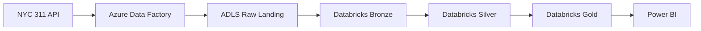

# Architecture Diagram

This document describes the intended high-level pipeline shape for the scaffold.

## Notes

- The ingestion source is represented as an external API placeholder.
- ADF is the orchestration layer in the target design.
- ADLS stores landed raw files and intermediate curated data.
- Databricks notebooks and `src/` modules are scaffolded, not production-ready.
- Power BI is represented as the intended reporting consumer for gold marts.

