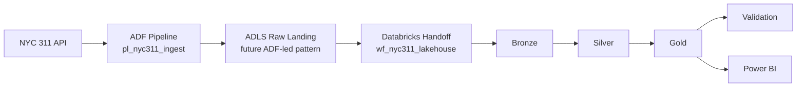

# Architecture Diagram

This document includes the saved architecture image that accompanies the project. The goal is to let a recruiter, hiring manager, or reviewer understand the system in a few seconds without implying that every Azure component is already deployed.

## Diagram Image

This saved PNG shows the planned Azure-first orchestration picture. Milestone 9 proves the manual Databricks-to-ADLS execution path, while the diagram still shows the broader next-step architecture with ADF and Power BI.

## Intended Diagram

The image should communicate a simple left-to-right target architecture:

## What The Diagram Should Communicate

- NYC 311 API is the external source system.
- ADF is the planned orchestration layer for a later phase.
- ADLS is the storage layer used by the current manual cloud run and the future orchestrated design.
- Databricks is the processing engine for the bronze, silver, gold, and validation sequence.
- Power BI is the intended downstream reporting consumer of gold outputs.

## Reviewer Guidance

- keep the architecture image visually simple; it should explain flow, not low-level deployment settings
- show validation as a post-processing control stage rather than a separate business-facing layer
- avoid implying private networking, CI/CD, monitoring dashboards, or production secrets that are not implemented in this repo
- if this document is later turned into a polished PNG or SVG, keep the same honest component list and left-to-right story

## Honest Status

- the current Milestone 9 proof point is manual Databricks execution writing bronze, silver, gold, and validation outputs to ADLS
- the ADF handoff and deployed Databricks workflow shown in the diagram are still target-state components rather than completed deployment artifacts
- the local Python modules remain the core implementation surface in the repository
