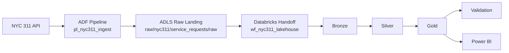

# Architecture Diagram

This document includes the saved architecture image that accompanies the project. The goal is to let a recruiter, hiring manager, or reviewer understand the system in a few seconds without implying that every Azure component is already deployed.

## Diagram Image

This saved PNG gives a quick view of the intended Azure-first lakehouse flow before the detailed notes below.

## Intended Diagram

The image should communicate a simple left-to-right execution story:

## What The Diagram Should Communicate

- NYC 311 API is the external source system.
- ADF is the orchestration layer responsible for scheduled or manual ingestion and raw landing.
- ADLS is the landing and lake storage layer for raw files, checkpoints, and curated outputs.
- Databricks is the intended processing engine for the bronze, silver, gold, and validation sequence.
- Power BI is the intended downstream reporting consumer of gold outputs.

## Reviewer Guidance

- keep the architecture image visually simple; it should explain flow, not low-level deployment settings
- show validation as a post-processing control stage rather than a separate business-facing layer
- avoid implying private networking, CI/CD, monitoring dashboards, or production secrets that are not implemented in this repo
- if this document is later turned into a polished PNG or SVG, keep the same honest component list and left-to-right story

## Honest Status

- the ADF, ADLS, and Databricks elements are documented target-state components, not proof of a completed Azure deployment
- the local Python modules remain the most concrete implementation in the repository today
