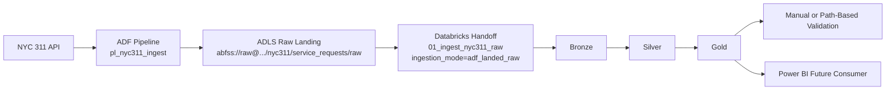

# Architecture Diagram

This document includes the saved architecture image that accompanies the project. The goal is to let a recruiter, hiring manager, or reviewer understand the system in a few seconds without implying that every Azure component is already deployed.

## Diagram Image

This saved PNG reflects the Milestone 11 end-to-end architecture that was used for the final documentation proof. Earlier Milestone 9 and 10 evidence from the original workspace remains valid, but the final Milestone 11 proof was captured in the new workspace `dbw-test-centralus-01`.

## Intended Diagram

The image should communicate a simple left-to-right target architecture:

## What The Diagram Should Communicate

- NYC 311 API is the external source system.
- ADF now performs the real raw landing and hands off to Databricks.
- ADLS stores the landed raw JSON plus the bronze, silver, and gold Delta outputs.
- Databricks is the processing engine for the bronze, silver, and gold sequence after the ADF handoff.
- the final Milestone 11 validation proof used manual or path-based checks against ADLS-backed Delta data in the new workspace.
- Power BI remains the intended downstream reporting consumer of gold outputs rather than a completed report deliverable.

## Reviewer Guidance

- keep the architecture image visually simple; it should explain flow, not low-level deployment settings
- show validation as a post-processing control stage rather than a separate business-facing layer
- avoid implying private networking, CI/CD, monitoring dashboards, or production secrets that are not implemented in this repo
- if this document is later turned into a polished PNG or SVG, keep the same honest component list and left-to-right story

## Honest Status

- Milestone 11 makes the ADF raw landing plus Databricks handoff real, but the repo-side JSON files are still starter deployment assets rather than a production deployment package
- the original workspace later entered a stale credits-exhausted state after a subscription upgrade, so the final Milestone 11 proof moved to `dbw-test-centralus-01`
- the local Python modules remain the core implementation surface in the repository
